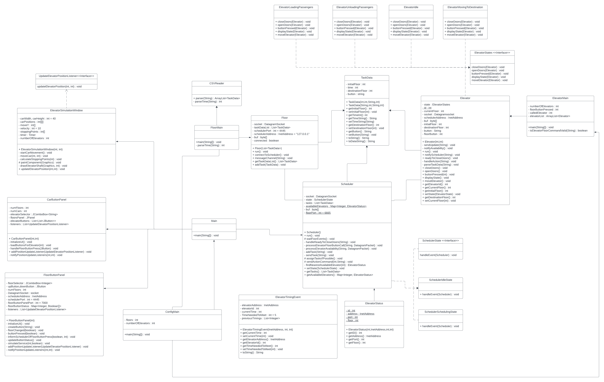
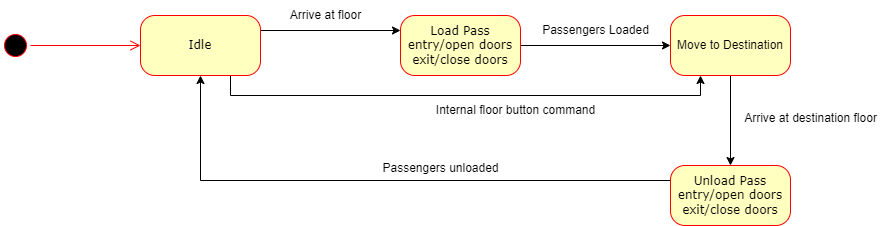
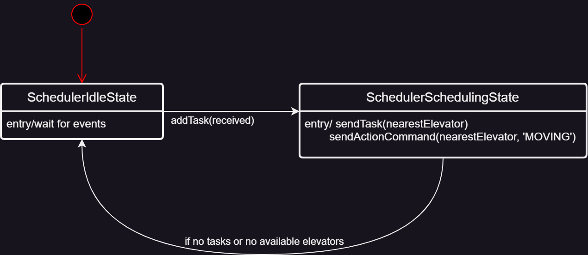

# SYSC3303 Elevator 
___
This repository is for the SYSC3303 Elevator Group Project.

## Table of Contents
___
- Description
  - UML Class Diagram
  - UML Sequence Diagram
  - Elevator State Diagram
  - Scheduler State Diagram
  - Floor Timing Diagram
  - Door Timing Diagram
- Getting started
  - Prerequisites
  - Setup
  - Usage
- Credits

## Description
___
The project is composed of an elevator control system and simulator. The system consists of an
elevator controller (the Scheduler), a simulator for the elevator cars (which includes, the lights, buttons, doors
and motors) and a simulator for the floors. The elevator controller is multi-threaded, and the simulation is configurable in terms of the number of floors,
the number number of elevators, the time it takes to open and close the doors, and the time it takes to move
between floors. These values are stored in a CSV file located in src.

### UML Class Diagram


### UML Sequence Diagram


### Elevator State Diagram


### Scheduler State Diagram


### Floor Timing Diagram


### Door Timing Diagram


## Geting Started
___
### Prerequisites
Ensure that you have Java installed on your system.
The test classes for this project use JUnit 5.
JUnit 5 requires Java 8 (or higher) at runtime. 

### Setup
Add tasks to the csv file with the name "ElevatorCallSheet - Sheet1.csv" in the src folder with the following format:

    Time,Floor,Floor Button,Car Button
    hh:mm:ss.mmm,n,Up/Down,n

    Followed by the values in rows below it ordered by time
    Example CSV file:

    Time,Floor,Floor Button,Car Button, Error type (unless G for Good)
    hh:mm:ss.mmm,n,Up/Down,n
    14:05:15,2,Up,4,G
    15:06:05,4,Down,1,G
    19:00:00,1,Up,2,Timing
    22:25:55,3,Down,2,Door

### Usage
First, open your terminal and navigate to the project's root directory. Then do the following:
1. Compile all Java files:

```javac -d out -cp src src/**/*.java```

2. Run the program:

```java FloorMain```
```java ConfigMain```

## Credits
___

- Jestan Brar

- Daniel Godfrey

- Ibtasam Rasool

- Saad Sheikh

- Quinton Tracey 


